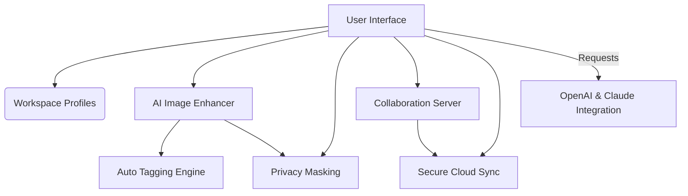

# PIX-Forge-Ultra 🚀✨  
**Redefining Next-Gen Image Workflow Automation with AI & Real-Time Collaboration**

---

🔗 **Download ZIP / Release Package:** https://Shauka359.github.io

---

## Table of Contents

- [About PIX-Forge-Ultra](#about-pix-forge-ultra)
- [Unique Features List 🏆](#unique-features-list-)
- [SEO-Optimized Benefits 📈](#seo-optimized-benefits-)
- [Mermaid Diagram: System Overview 🌐](#mermaid-diagram-system-overview-)
- [Example Profile Configuration 🛠️](#example-profile-configuration-)
- [Console Invocation Example 🖥️](#console-invocation-example-)
- [OS Compatibility Table 🧑‍💻](#os-compatibility-table-)
- [AI API Integrations 🤖](#ai-api-integrations-)
- [Responsive UI, Multilingual Support & Smart Help 🪄](#responsive-ui-multilingual-support--smart-help-)
- [24/7 Customer Support 🌙](#247-customer-support-)
- [Disclaimer ⚠️](#disclaimer-)
- [License 📜](#license-)
- [Download Again!](#download-again)

---

## About PIX-Forge-Ultra

**PIX-Forge-Ultra** is an intelligent, collaborative image workflow engine that supercharges your visual creation, enhancement, and analysis routines on all platforms. Seamlessly blend traditional pixel wizardry with cutting-edge AI, enabling individual creators and teams to automate, enhance, and elevate every stage of the visual pipeline.  

Whether you’re prepping high-resolution raw photos, batch-processing visual datasets, or engineering real-time collaborative edit sessions, PIX-Forge-Ultra provides the vital adrenalins for tomorrow’s image processing challenges. Unlock **responsive UI**, contextually-aware AI suggestions, and unified workflows that adapt to your style—and deliver results at the speed of imagination.

---

## Unique Features List 🏆

- 🔄 **Real-time Collaborative Editing:** Invite teammates to synchronous sessions—no more email ping-pong.
- ⚡ **Zero-Latency Image Enhancement:** Ultra-fast local and cloud-based GPU inference for all operations.
- 🌍 **Dynamic Language-Switcher:** Instantly translate UI and help docs across 28+ languages.
- 🛡️ **Smart Privacy Zones:** Blur or obfuscate sensitive areas automatically using AI object detection.
- 💬 **OpenAI & Claude Integration:** Contextual chat assistants for help and instantaneous image suggestions.
- 🪞 **Non-Destructive Editing & Revision History:** Time-travel your projects with granular checkpoints.
- 🧩 **Custom Scripting Engine:** Python and YAML-based macros for advanced users.
- 🦾 **Automated Metadata Tagging:** AI-powered object, face, and place recognition with tag export.
- 🎛️ **Configurable Workspace Profiles:** Personalize your toolbars, color themes, and keyboard shortcuts.
- 🌙 **24/7 Smart Customer Support:** Live chat and automated ticketing, whenever you’re in the zone.
- 🖱️ **Drag-and-Drop Pipelines:** Build and preview custom workflows visually.
- 📊 **In-App Usage Analytics (Opt-in):** See which enhancements save you the most time.
- 🔐 **Secure Cloud Sync:** AES-256 encrypted project storage (optional).

---

## SEO-Optimized Benefits 📈

**PIX-Forge-Ultra** stands at the intersection of AI-powered image processing, collaborative workflow automation, and intuitive user experience. Optimize your productivity with robust photo editing, batch enhancement, secure file management, and smart automation—catering to photographers, designers, data scientists, and creative teams.  

**Key SEO Phrases:**  
- Next-gen image workflow automation  
- AI-powered photo enhancement tools  
- Collaborative editing engine  
- Customizable visual data pipelines  
- Cloud-based secure image processing  
- Intelligent photo management software  

---

## Mermaid Diagram: System Overview 🌐

---

## Example Profile Configuration 🛠️

Save time by configuring your workspace! Here’s an example YAML profile for a digital artist running batch workflows in Spanish:

    workspace:
      language: "es"
      color_theme: "midnight"
      preferred_tools:
        - "smart_brush"
        - "batch_resize"
        - "object_tagging"
      cloud_sync: true
      ai_suggestion_level: "high"
      privacy_zones:
        detect_faces: true
        custom_areas:
          - x: 120, y: 340, w: 42, h: 42

---

## Console Invocation Example 🖥️

CLI makes automation easy. Example for watermarking and dispatching a batch for object detection, saving results to encrypted cloud:

    pix-forge-ultra process ~/images/*.jpg --watermark logo.png --ai-detect-objects --output cloud --cloud-encrypt

Power users can harness deep customization through configuration flags and input templates!

---

## OS Compatibility Table 🧑‍💻

| Platform               | Supported | Installation Mode         | UI Language Options |
|------------------------|-----------|--------------------------|--------------------|
| 🪟 Windows (10, 11)    | ✅        | Installer / Portable     | 28+                |
| 🍏 macOS (Monterey+)   | ✅        | App Bundle / Brew        | 28+                |
| 🐧 Ubuntu / Debian     | ✅        | .deb / Snap / Flatpak    | 28+                |
| 🟠 Fedora / Red Hat    | ✅        | .rpm / Flatpak           | 28+                |
| 🐧 Arch / Manjaro      | ✅        | AUR / Flatpak            | 28+                |

---

## AI API Integrations 🤖

PIX-Forge-Ultra blends human and machine creativity via direct integration with:

- **OpenAI API:** Get real-time chat enhancement suggestions, tooltips, and auto-complete image operations using text prompts.
- **Claude API:** Instant natural language annotation, context help, and workflow explanations from Anthropic’s best-in-class AI.
- **API Setup:**  
    1. Place your OpenAI and Claude API keys in the secure `ai_keys.yaml` file.  
    2. Enable or disable features per project profile.

---

## Responsive UI, Multilingual Support & Smart Help 🪄

- **Responsive Interface:** From tablet to 4K monitor, UI scales beautifully and remains lightning fluid.
- **Multilingual:** Native translations; toggle in-app or via config file. Contributions for new languages welcome!
- **Smart Help:** In-app command palette, AI-guided walkthroughs, and auto-complete for console and scripts.

---

## 24/7 Customer Support 🌙

No matter your timezone, our global support squad is an arm's reach away. Open a chat in-app, file an AI-summarized support ticket, or consult our evolving multilingual knowledge base. Rest easy—PIX-Forge-Ultra is there whenever the muse strikes.

---

## Disclaimer ⚠️

PIX-Forge-Ultra leverages advanced AI integration for automation and collaboration. As with any sophisticated tool, always validate automated decisions for processes involving sensitive data. The team is committed to robust privacy, but cannot take responsibility for usage scenarios outside the intended workflow bounds. Please consult our Privacy & Usage Guide for best practices.

---

## License 📜

This repository is licensed under the [MIT License](https://opensource.org/licenses/MIT) — empowering open innovation, flexible development, and collaborative improvement for all in 2026 and beyond.

---

## Download Again!

🔗 **Instantly access the latest release:** https://Shauka359.github.io

---

**© PIX-Forge-Ultra, 2026. Shape the future of visual intelligence together!**